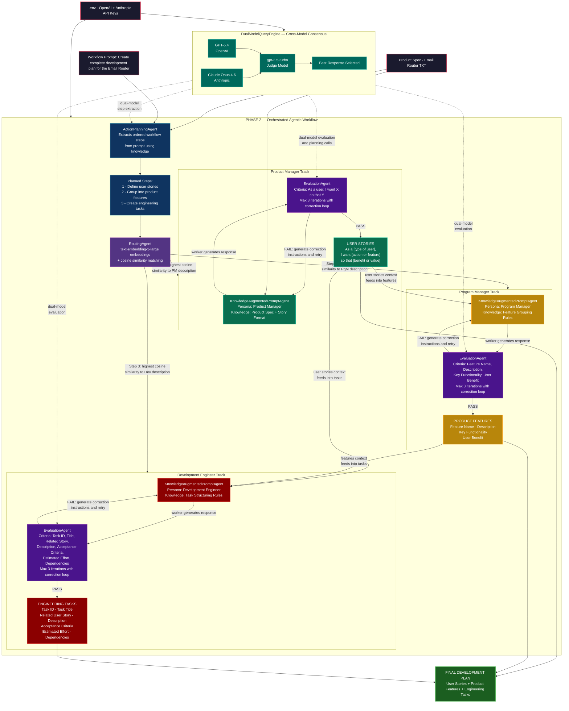
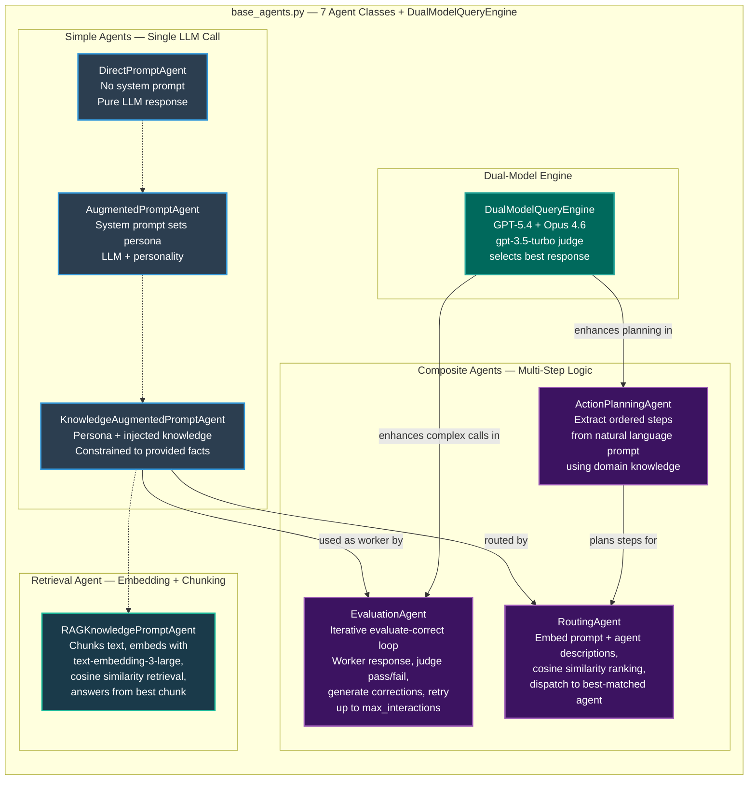
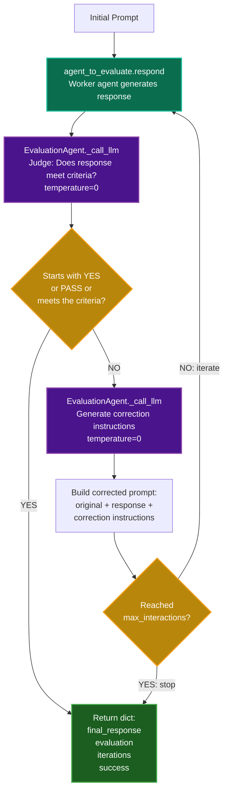
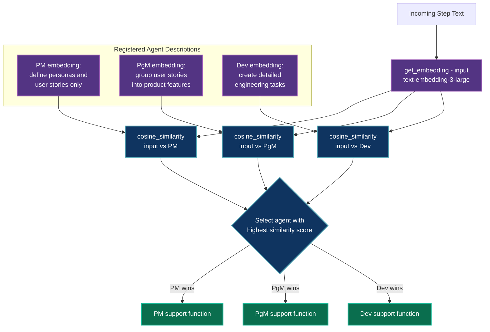
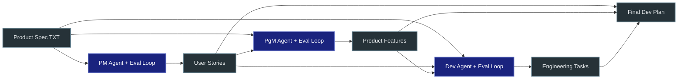

# Program Overview — AI-Powered Agentic Workflow for Email Router

## System Flow Diagram

---

## Phase 1 — Agent Library Architecture

---

## Evaluation Agent — Internal Correction Loop Detail

---

## Routing Agent — Semantic Dispatch Detail

---

## Data Flow Summary

